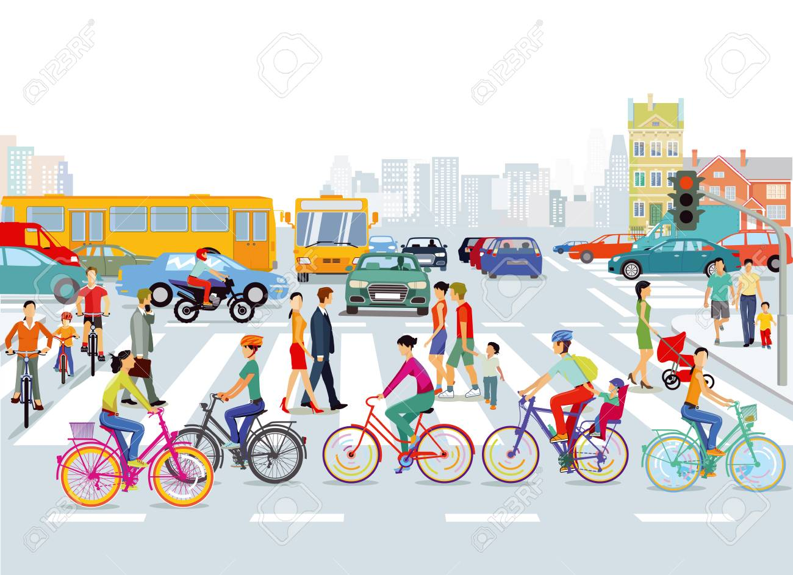
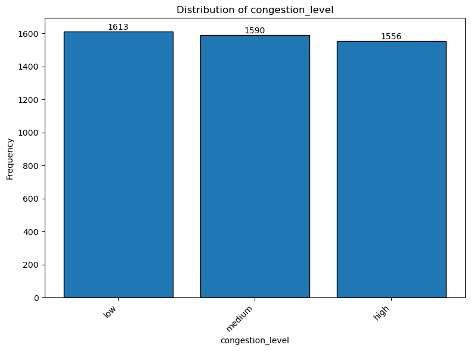

### TRAFFIC ANALYSIS PROJECT

## Overview:  
The urban mobility and transportation sector are vital for the functioning of modern cities, enabling the movement of people and goods efficiently. Within this industry, traffic management and pedestrian safety are crucial components that directly impact the quality of life in urban areas. Effective traffic pattern analysis and prediction can help mitigate congestion, enhance safety, and improve overall urban mobility.
Well managed traffic leads to minimized economic losses, improved quality of life especially on the side of pedestrians.

## Problem Statement:

Urban areas continue to face significant challenges in managing their traffic congestion and ensuring pedestrian safety. The changing nature of these areas together with the increasing volume of both vehicle and pedestrian traffic, makes it hard for one to predict traffic patterns affectively.

## Objective :
Our primary objective is to create an accurate time series model(s) that can model, analyze and predict traffic congestion levels and pedestrian crossings at different times of the day.

### Specific objectives:
1.  To identify key factors that influence traffic and pedestrian movement
2.  To develop predictive models for forecasting future traffic congestion and pedestrian crossing patterns.
3.  To provide recommendations for urban planners and traffic management authorities to improve traffic flow and pedestrian safety.

## Data Understanding
The data to use in this study is sourced from the UC Irvine Machine Learning Repository.  It has 4760 rows and 22 data features.

 
## Modeling
In this study, we used the following models:
1. SARIMA 
2. Random Forest
3. Decision Tree
4. ARIMA
5. LightGBM

## Conclusion
The project yielded the desired results. The main objective and specific objectives were all satisfied.

The best models that modeled our data were ARIMA both for the pedestrian count and vehicle count and Random Forest for the congestion levels

## Recommendations
We would recommend the following to those who formulate policies in the urban mobility and transportation sector:

Encourage businesses and schools to adopt staggered start times, particularly around the critical periods of 8:00 AM and 2:00 PM. This can help distribute traffic more evenly throughout the day, reducing peak congestion

During identified peak pedestrian and vehicle congestion times, increase and encourage the frequency use of trains. This can help reduce the number of vehicles on the road, reducing congestion.

Given that pedestrian counts drop significantly after 3:00 PM, encourage walking and cycling during these times by improving infrastructure, such as creating safer, well-lit walkways and cycling paths. This could reduce vehicle congestion and promote healthier lifestyles.

Run public awareness campaigns to educate commuters about the best times to travel and the benefits of using alternative transportation modes during peak congestion times. This could include promoting the use of public transport or cycling.

Consider implementing congestion charges during peak hours to discourage unnecessary trips and reduce the number of vehicles on the road